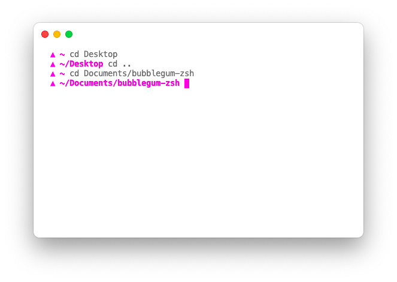

# bubblegum-zsh
a deliciously minimalist bright pink theme for [Oh My Zsh](https://github.com/ohmyzsh/ohmyzsh/), based on the shell theme used in [Hyper](http://hyper.is/) terminal's promotional materials.

a triangular glyph and your working directory, nothing else—leaving you with the cleanest shell possible.

## installation

1. obtain `bubblegum.zsh-theme` from this repository
2. place it in your Oh-My-Zsh theme directory, located by default at `~/.oh-my-zsh/themes/`
3. set `ZSH_THEME='bubblegum'` in your `~/.zshrc` file
4. reload your Zsh configuration by running `zsh`

## extras
for my terminal setup i use the following:
* the [Zsh](www.zsh.org) shell and [Oh My Zsh](https://github.com/ohmyzsh/ohmyzsh/) (obviously)
* [Hyper](http://hyper.is/) terminal and my custom theme, [hyper-bubblegum](https://github.com/ice-bear-forever/hyper-bubblegum/)

## credits
as mentioned earlier, this theme is (very heavily) based on the shell theme used in [Hyper](http://hyper.is/) terminal's promotional materials.

## license
copyright (c) 2020 bear.
released under the GNU Affero General Public License v3.
see [LICENSE](LICENSE) for details.
